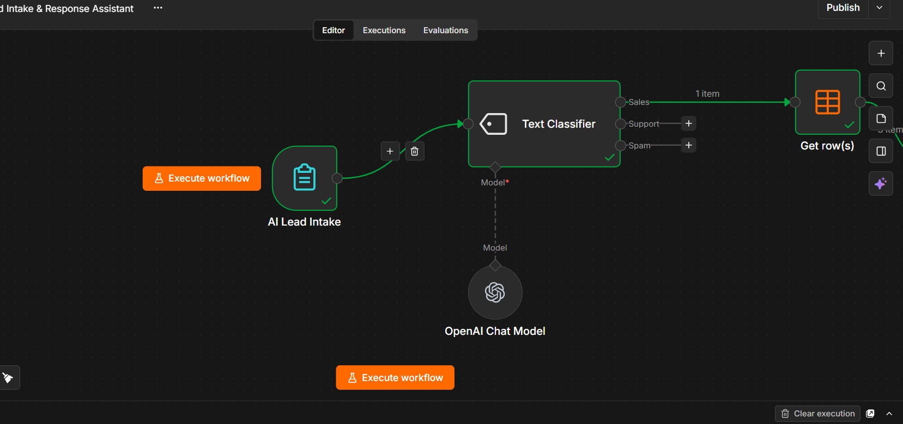
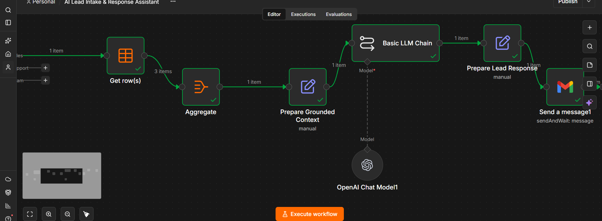
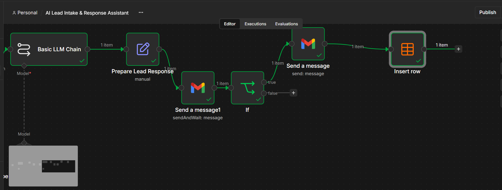

# AI Lead Intake & Response Assistant

An AI-powered lead intake and response automation built with n8n.

The workflow classifies incoming leads, retrieves relevant company knowledge, generates grounded AI responses, requires human approval before customer-facing communication, sends approved responses through Gmail, and logs the interaction for tracking.

## Workflow Overview

The automation follows a human-in-the-loop AI workflow:

1. A lead submits an inquiry through an n8n form.
2. AI classifies the inquiry as **Sales**, **Support**, or **Spam**.
3. Relevant company information is retrieved from the knowledge base.
4. The retrieved information is aggregated into grounded context.
5. An LLM generates a response using that context.
6. A human reviews and approves the generated response.
7. Only approved responses are sent through Gmail.
8. Lead and response information is stored in an n8n Data Table.

## 1. Lead Intake & Classification

Incoming leads are captured through an n8n form and automatically classified before entering the response pipeline.

## 2. Grounded AI Response Generation

Relevant company information is retrieved from the knowledge base and aggregated into context before being provided to the LLM. This helps keep generated responses grounded in approved company information.

## 3. Human Approval & Email Delivery

The generated response is sent for human review. The workflow checks the approval result and only sends the customer-facing email when the response has been approved. The completed interaction is then logged.

## Key Features

- AI-based lead classification
- Sales, Support, and Spam routing
- Knowledge-base retrieval
- Grounded LLM response generation
- Human-in-the-loop approval
- Conditional email delivery
- Gmail integration
- Data Table logging
- Reusable n8n workflow

## Tech Stack

- n8n
- OpenAI
- Gmail
- n8n Data Tables
- n8n Forms

## Workflow File

The complete n8n workflow is included in this repository:

`AI-Lead-Intake-Response-Assistant.json`

It can be imported into n8n and configured with your own credentials and data sources.

> Note: Credentials and secrets are not included in the exported workflow. Configure your own integrations before running it.

## Architecture

`Lead Form → AI Classification → Knowledge Retrieval → Context Aggregation → LLM Response → Human Approval → Conditional Gmail Send → Data Logging`

## Purpose

This project demonstrates how AI can be incorporated into a practical business automation while keeping customer-facing communication grounded in company information and under human control.
